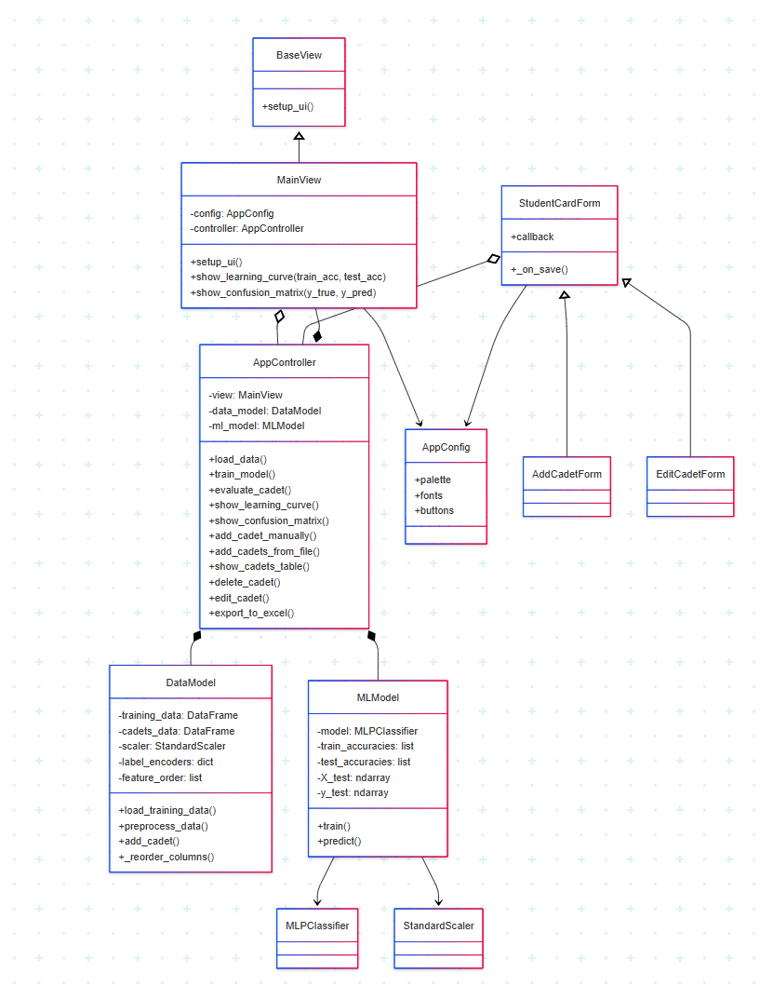

**FlightApp** — это приложение на Python с графическим интерфейсом (Tkinter) для оценки профпригодности курсантов с использованием моделей машинного обучения.

---

<p align="center">
  <strong>Диаграмма классов</strong><br>
  
</p>

---

## 🧱 Архитектура проекта

```plaintext
├── main.py             # Точка входа
├── config.py           # Конфигурация интерфейса
├── controller.py       # Контроллер приложения (связывает модель и UI)
├── data_model.py       # Загрузка и предобработка данных
├── ml_model.py         # Обучение и предсказания модели
├── ui/
│   ├── base_view.py    # Абстрактный UI
│   ├── main_view.py    # Основной интерфейс
│   └── forms.py        # Формы добавления/редактирования курсантов
